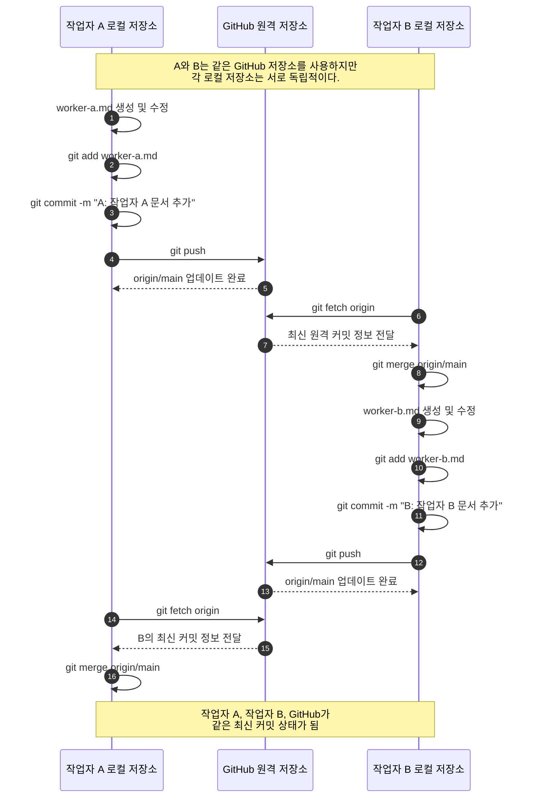
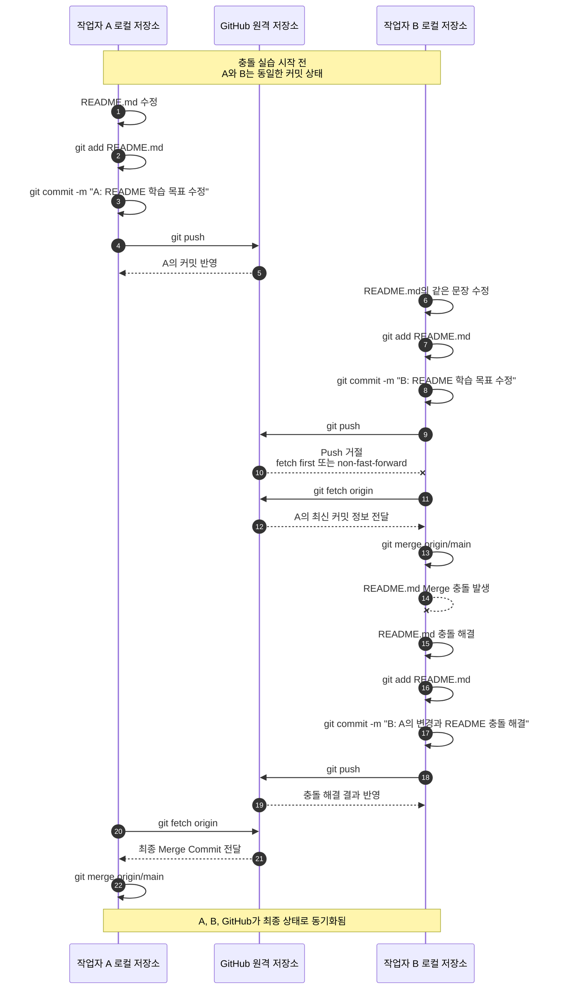

# 2026-git-start
GitHub 와   로컬   저장소의 Merge  충돌   해결   실습

- 로컬 컴퓨터에서 추가한 내용입니다.
- GitHub 웹에서 추가한 내용입니다.

## 오늘의 학습 목표: Git 협업 이해
- 작업자 A·B의 Git 협업 및 Merge 충돌 해결

## Git 협업 시퀀스 다이어그램

## 같은 파일을 수정하여 충돌 발생

